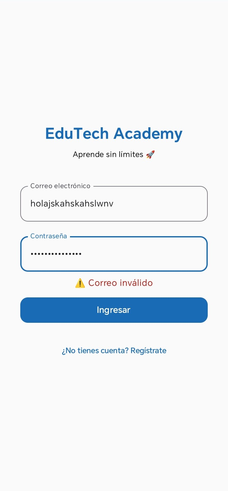
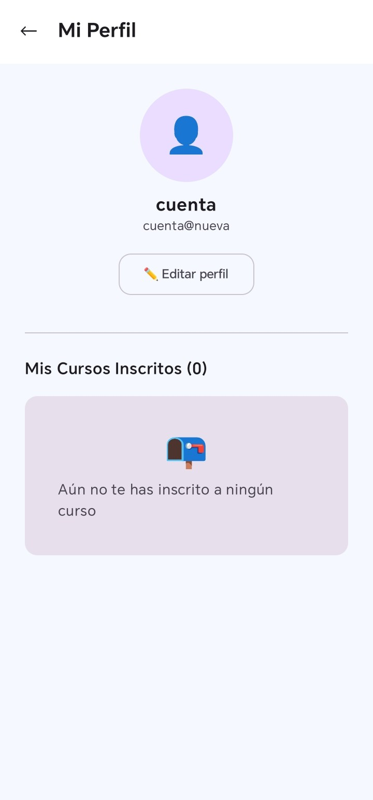
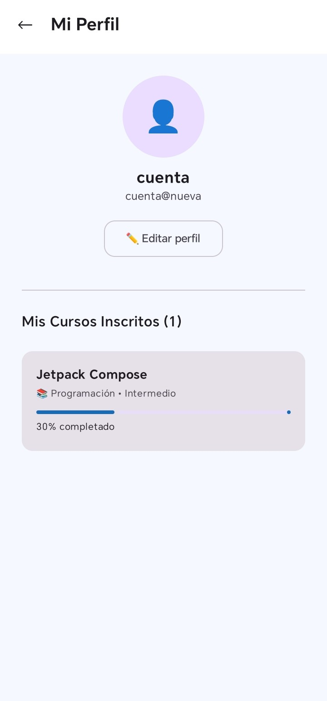

# ✨ Etapa 2: Mejora con Gemini in Android Studio

[cite_start]Actuando como **Diseñador Senior**, se utilizó Gemini para auditar y optimizar la experiencia de usuario (UI/UX) de la aplicación[cite: 64, 66].

---

## 🔍 Auditoría de UI/UX
[cite_start]Se analizaron las siguientes pantallas para identificar puntos de mejora[cite: 67]:
1. Pantalla de Login
2. Pantalla de Registro
3. Pantalla de Perfil / Mis Cursos

---

## 🛠️ Mejoras Implementadas (Antes vs Después)

| Mejora | Prompt Utilizado en Gemini | Resultado Visual |
| :--- | :--- | :--- |
| **1. Validación de Login** | "¿Cómo puedo agregar validación para que el correo tenga formato válido con @ antes de permitir el inicio de sesión?" |  |
| **2. Persistencia de Usuario** | "¿Cómo puedo pasar y mostrar correctamente la información del usuario registrado en la pantalla de Perfil?" |  |
| **3. Sincronización de Cursos** | "¿Cómo sincronizo el estado de inscripción entre la pantalla de Cursos y el Perfil del usuario?" |  |

---

## 📝 Reflexiones del Proceso
* [cite_start]**Sobre la validación:** Antes se aceptaba cualquier texto; ahora se garantiza un formato de correo real, mejorando la seguridad inicial del flujo[cite: 86].
* [cite_start]**Sobre la persistencia:** Se eliminó la confusión de mostrar datos genéricos, logrando que el usuario vea su identidad real tras el registro[cite: 86].
* [cite_start]**Sobre la sincronización:** La app ahora es coherente; el usuario sabe exactamente en qué cursos está inscrito desde cualquier pantalla[cite: 86].

---

## 👨‍🏫 Información de Entrega
* [cite_start]**Docente:** Juan José León Suiyon [cite: 89]
* [cite_start]**Modalidad:** Parejas (2 integrantes) [cite: 3]
* [cite_start]**Duración:** 1 semana [cite: 3]