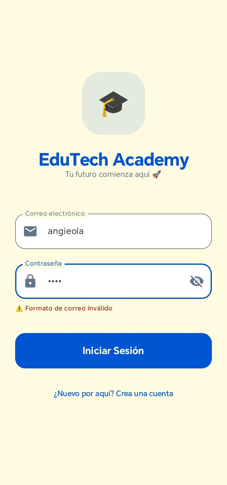
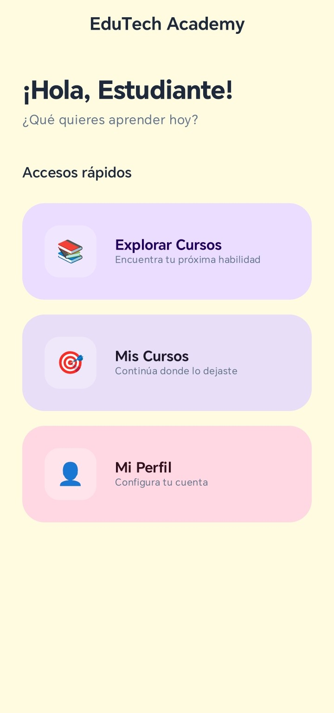
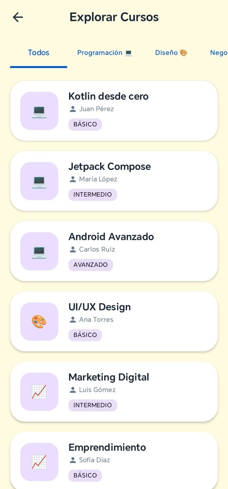
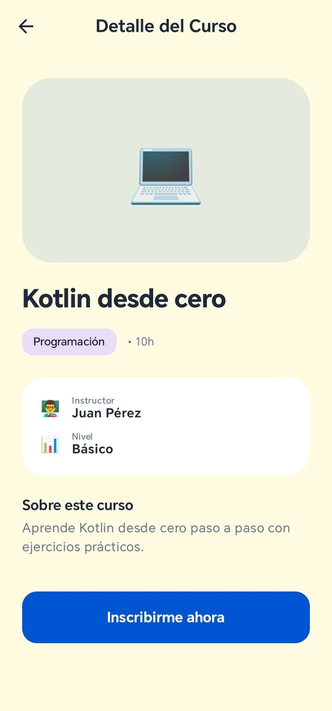
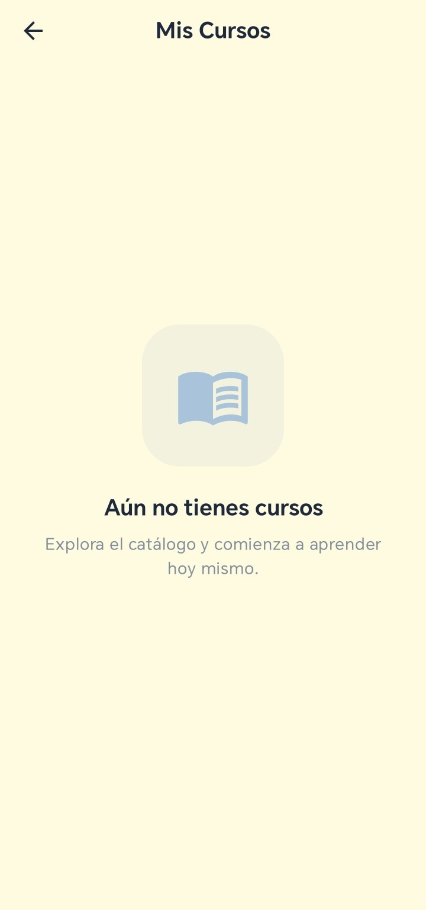
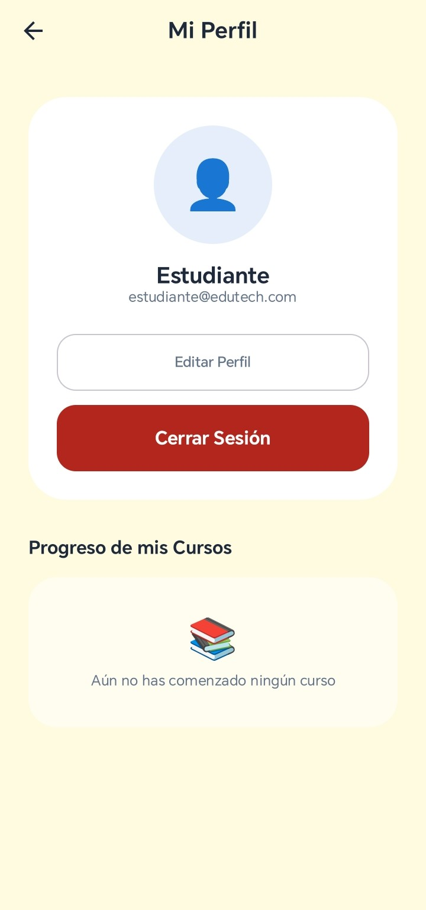

# 📂 Etapa 2: Auditoría y Optimización con Gemini

Actuando bajo el rol de **Diseñador Senior**, se utilizó la potencia de **Gemini in Android Studio** para elevar el estándar de calidad de la aplicación.

## Auditoría de UI/UX (3 Pantallas Analizadas)
Se ejecutó un análisis profundo sobre los flujos de:
1. **Módulo de Autenticación:** Detección de fallos en la validación de entrada.
2. **Módulo de Perfil:** Identificación de falta de persistencia visual.
3. **Módulo de Cursos:** Análisis de consistencia en el estado de inscripción.

---

## Matriz de Mejoras Implementadas

| Mejora Técnica               | Prompt Utilizado en Gemini                                                                                              | Impacto en el Proyecto                                                             |
|:-----------------------------|:------------------------------------------------------------------------------------------------------------------------|:-----------------------------------------------------------------------------------|
| **Validación de Login**      | *"¿Cómo puedo agregar validación para que el correo tenga formato válido con @ antes de permitir el inicio de sesión?"* | **Seguridad:** Eliminación de registros con formatos erróneos.                     |
| **Persistencia de Perfil**   | *"¿Cómo puedo pasar y mostrar correctamente la información del usuario registrado en la pantalla de Perfil?"*           | **UX Personalizada:** El perfil refleja la identidad real del usuario autenticado. |
| **Sincronización de Estado** | *"¿Cómo sincronizo el estado de inscripción entre la pantalla de Cursos y el Perfil del usuario?"*                      | **Consistencia:** Sincronización en tiempo real del progreso académico.            |

## 📸 Diseño Mejorado

| Mejora Técnica     | Prompt Utilizado en Gemini                         |
|:-------------------|:---------------------------------------------------|
| **Auth**           | ****  |
| **Dashboard**      | ****  |
| **Catalog**        | **** |
| **Course Detail**  | **** |
| **My courses**     | ****  |
| **User Profile**   | ****  |

---

## Reflexión y Conclusiones
La integración de Gemini permitió transformar un prototipo básico en una aplicación de nivel profesional. Las mejoras en la **jerarquía visual**, la **lógica de validación** y la **sincronización de estados** garantizan que la app sea robusta, confiable y estéticamente superior.
